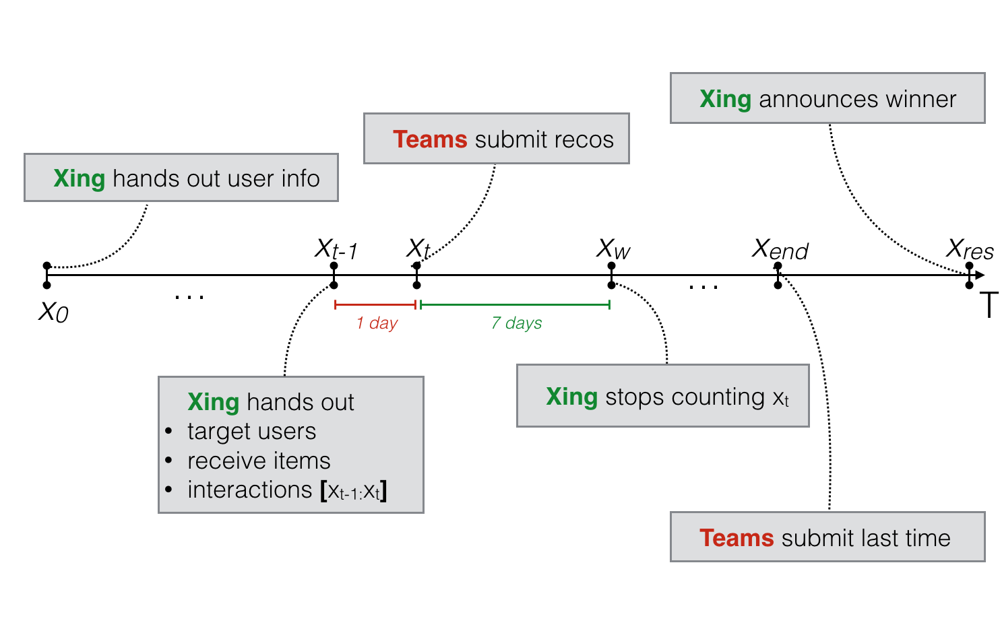

Live Challenge
=====================

The live challenge is set up as follows. The goal of each team is to 
find find user item pairs that promise a mutual interest between a job
seeking user and the recruiter that is associated with the posting.

Teams will be presented with a set of users and their profile information 
at the beginning of the challenge. This set stays valid throughout the whole
live challenge period. Each day the teams then receive a set of target
users and a set of new items. The items include the same information 
as in the offline challenge. Teams will then submit user item pairs
in the 24 hours after the daily release. Teams will be allowed to
submit each user id from their target list one time. It is ok if 
the team chooses to not play out a recommendation for a user. 
If the team submits a posting older than 24 hours, a user
not in their target list or a user they qalreadhy pushed to that
day, the system will simply ignore the following information.
On top of the target users and the new items, teams will
also receive a list of impressions and interactions of the
previous day. The impressions will also include
recommendations from other teams. 
The score will be calculated on all item user pairs a team submitted.
A submitted recommendations can be interacted with for one week.
Afterwards, the interactions of a user with that item do not
count towards the final score. 
The winning team is the one that achieved the highest
sum of their two best scoring weeks. The winnner
of the challenge will be announced one week after
the last submisssion slot.

Online Data Description:
---------------

+ Xing releases user information once:
	- Xing hands out one million users with their respective profile information
	- The user information contains the same fields as released in the offline challenge
	- The user information is not updated during the challenge
	- The set of users doesn't change during the challenge

+ Xing releases target users once per day:
	- Every day we hand out a set of K target users for each team
	- The set of target users is a subset of the released users
	- Each team will get a different target user set every day
	- Teams can only submit recommendations for those users

+ Xing releases item information once per day:
	- Every day we hand out all new items 
    - The teams have to recommend users from their target list to these items
	- The item information will contain the same information as released in the offline challenge
	- The items can only be recommended for 24 hours after the release

+ Xing releases interactions from previous day, once a day:
	- Every day we hand out all interactions that happened during the last day on the challenge specific recommendations
    - Specifically we hand out all recommendations that were played out to users and
    all interactions which users are in the target user set and items that are in the dayly item set.
	- The interactions can be of the following type:
		* User Click
		* User Delete
		* User Bookmark / Reply Intention
		* User Delete
		* Recruiter interest
		* Team Impression 
	- The user interactions are the same as in the offline challenge
	- The team's impression indicate that a team attempted a recommendation (the team is not known)
	- A xing decline is an indicator that our recommender filtered the recommendation out. That means that we do not guarantee that all recommendations are shown to the user

Recommendations:
---------------
	
+ After the teams received the daily data dump and their target users:
	- The teams have 24 hours to submit their recommendations.
	- The target users change every day.
	- The items change every day.

+ Recommendations:
	- Every team can submit one recommendation per target user that day		
	- There is no guarantee that the recommendation is player out since each item has to pass our recommendation filters.
	- A recommendation is valid for 7 days. In other words means once played out we count interactions with the item for one week
		  extactly afer the release. Afterwards the interaction does not count into a teams score.

+ The scoring function stays the same as in the offline challange:
	- Clicks, Bookmarks / Reply Intentions, Recruiter interest count positive towards the teams score.
	- Deletes count negative towards the score.
	- Unclicked impressions or declines do not influence the score.

+ Winning:
	- The winner of the challenge is announced one week after the final submission
	- Per week the score is summed over all recommendations
	- The final score for a team is the sum of their best two weeks
